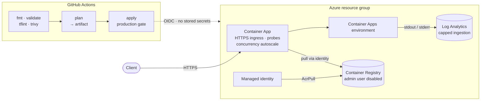
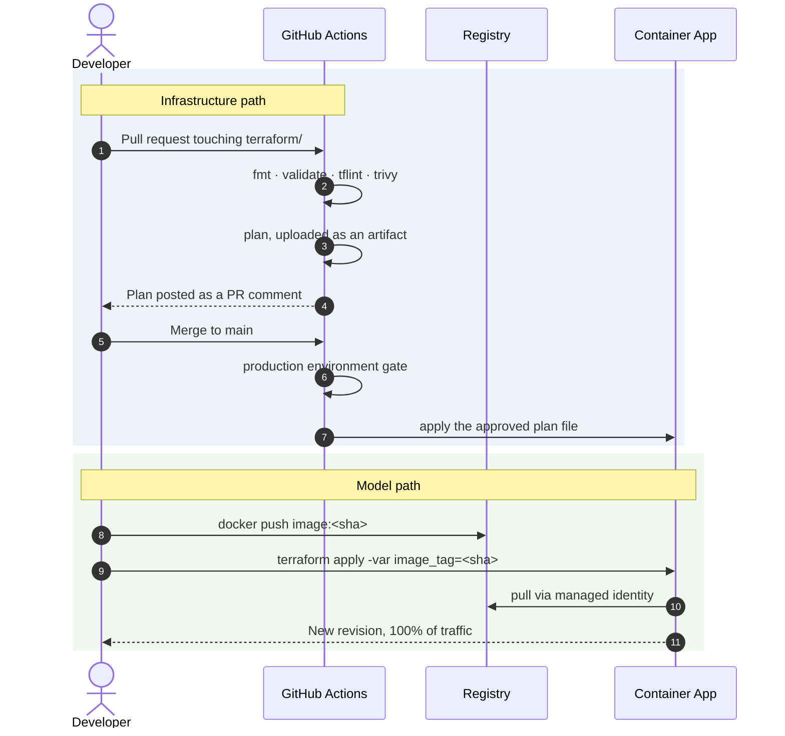

<div align="center">

# mlops-iac-terraform

### Production-shaped infrastructure for serving an ML model on Azure Container Apps

Registry · identity · ingress · autoscaling · health probes · log routing —
provisioned by Terraform, reviewed as a plan on every pull request, applied behind a human gate.

[](https://github.com/jumma786/mlops-iac-terraform/actions/workflows/terraform.yml)
[](https://developer.hashicorp.com/terraform)
[](https://azure.microsoft.com/products/container-apps)
[](#security-posture)
[](#verification)

</div>

**Related:** [Portfolio entry](https://jumma786.github.io/portfolio/#projects) · [Medium case study](https://medium.com/@jummamohammad477/infrastructure-as-code-583bd28b92bf)

---

|  |  |
|---|---|
| **Deploys** | Any containerised model server. Ships [`hospital-readmission-api`](https://github.com/jumma786/hospital-readmission-api) by default |
| **Stored secrets** | **None.** Managed identity for pulls, OIDC for CI, Azure AD for state |
| **Review model** | Plan posted on the PR — and the *approved plan file* is what applies |
| **First apply** | Goes green against an empty registry (bootstrap mode) |
| **Guardrails** | Immutable tags enforced, cpu/memory validated, log ingestion capped |
| **Rollback** | Same command as roll-forward, previous tag |
| **Teardown** | `terraform destroy`, complete |

## Contents

[Overview](#overview) · [Architecture](#architecture) · [Engineering decisions](#engineering-decisions) · [Quick start](#quick-start) · [Operations](#operations) · [Configuration](#configuration) · [CI/CD](#cicd) · [Security posture](#security-posture) · [Cost](#cost) · [Troubleshooting](#troubleshooting) · [Verification](#verification) · [Limitations](#limitations)

---

## Overview

A model that only runs on the machine that trained it is not deployed.

The gap between a working container and a running service is registry access, identity,
ingress, scaling, health probes and log routing. Doing that by hand in a portal means
nobody can reproduce it, review it, or roll it back — and whoever clicked through it
becomes a single point of failure.

This repository makes the environment a **reviewable artefact**: the same commit produces
the same infrastructure, the plan is posted before anything changes, the apply runs *that*
plan rather than a fresh one, and teardown is one command.

### Repository layout

```
.
├── .github/workflows/terraform.yml   CI: validate → plan → gated apply
├── terraform/
│   ├── providers.tf                  Providers + partial remote-state backend
│   ├── variables.tf                  Inputs, with plan-time validation
│   ├── main.tf                       The stack
│   ├── outputs.tf                    Endpoints and resource names
│   ├── .tflint.hcl                   Lint rules (core + azurerm ruleset)
│   ├── backend.hcl.example           → backend.hcl        (gitignored)
│   └── terraform.tfvars.example      → terraform.tfvars   (gitignored)
└── README.md
```

---

## Architecture



### The two deploy paths

Infrastructure and models move independently, on purpose.



### What it creates

| Resource | Purpose |
|---|---|
| Resource group | Holds the stack; deletion blocked while resources exist |
| Container Registry (Basic) | Holds the model image. **Admin user disabled** |
| User-assigned managed identity | Pulls from the registry — no registry password exists |
| `AcrPull` role assignment | Pull only, scoped to this one registry |
| Log Analytics workspace | Container stdout/stderr in KQL, with a daily ingestion cap |
| Container Apps environment | Managed runtime backed by that workspace |
| Container App | The API: HTTPS ingress, liveness + readiness probes, autoscaling |

---

## Engineering decisions

Every row is a trade-off that was made deliberately, not a default that was inherited.

| Decision | Why | Trade-off accepted |
|---|---|---|
| **Managed identity + OIDC + Azure AD state auth** | No password, client secret or storage key exists to leak, rotate or commit | More RBAC to set up, including data-plane roles that Owner does not imply |
| **Readiness separate from liveness** | Readiness holds traffic back while the model loads; liveness restarts a replica that stopped serving. One combined probe forces a choice between serving a cold model and restarting a healthy one | Two probe configurations to keep in step with the app |
| **Immutable image tags, enforced at plan time** | A re-pushed `latest` produces no diff, so the revision silently keeps serving the old model. Pinning a SHA makes the tag change *the* deploy signal | No "just redeploy" shortcut; a tag must be supplied |
| **Bootstrap mode** | A first apply against an empty registry would otherwise create a revision that can never pull | One extra apply to reach the real image |
| **`min_replicas = 0`** | No idle cost | Cold-start latency, including model load, on the first request |
| **Concurrency autoscaling, not CPU** | Inference latency degrades on request queueing well before CPU saturates | Needs a sensible concurrency number per model |
| **Apply the reviewed plan file** | An approval gate is theatre if the apply re-plans afterwards | A stale plan fails and the run must be repeated |
| **Capped log ingestion** | Ingestion is the one line item here that bills without limit | A log storm truncates instead of billing |
| **`Single` revision mode** | Rollback and roll-forward are the same command, so there is no separate, less-rehearsed recovery path to get wrong under pressure | No canary or weighted traffic split |
| **Random suffix on the registry name** | Registry names are globally unique | Losing state regenerates the suffix — see [Troubleshooting](#troubleshooting) |

---

## Quick start

| Requirement | Notes |
|---|---|
| Terraform >= 1.9 | Floor for cross-variable `validation`, used to reject bad cpu/memory pairs at plan time |
| Azure CLI | `az login` |
| Azure subscription | Contributor on the target subscription |
| State storage account | Created once — step 1 |

### 1 · Create the state backend

State is remote, not optional: a runner's local state is discarded when the job ends, so
every CI run would plan from empty and try to recreate a stack that already exists. The
backend is a *partial* configuration — `providers.tf` declares it, the storage account is
supplied at `init` time.

<details>
<summary><b>Show the one-time bootstrap commands</b></summary>

```bash
LOC=uksouth
RG=rg-tfstate
SA=sttfstate$RANDOM$RANDOM   # globally unique, 3-24 lowercase alphanumerics

az group create --name "$RG" --location "$LOC"

az storage account create \
  --name "$SA" --resource-group "$RG" --location "$LOC" \
  --sku Standard_LRS --kind StorageV2 \
  --allow-blob-public-access false --min-tls-version TLS1_2

# Versioning gives you a way back from a corrupted or truncated state file.
az storage account blob-service-properties update \
  --account-name "$SA" --resource-group "$RG" --enable-versioning true

az storage container create --name tfstate --account-name "$SA" --auth-mode login

# Data-plane access is separate from management-plane access: subscription Owner
# does not by itself let you read a blob. Grant the data role explicitly.
az role assignment create \
  --role "Storage Blob Data Contributor" \
  --assignee "$(az ad signed-in-user show --query id -o tsv)" \
  --scope "$(az storage account show --name "$SA" --resource-group "$RG" --query id -o tsv)"
```

</details>

### 2 · Initialise

```bash
cd terraform
cp backend.hcl.example backend.hcl   # fill in the values; backend.hcl is gitignored
terraform init -backend-config=backend.hcl
```

### 3 · First apply — bootstrap

```bash
terraform plan -out=tfplan
terraform apply tfplan

terraform output bootstrap_mode   # true — serving the placeholder
terraform output api_url
```

> The registry is empty at this point. Bootstrap mode runs a public placeholder, points
> ingress at its port and skips the probes, so this apply succeeds instead of creating a
> revision that can never pull.

### 4 · Ship the model

```bash
ACR=$(terraform output -raw acr_name)
REGISTRY=$(terraform output -raw acr_login_server)
TAG=$(git -C ../../hospital-readmission-api rev-parse --short HEAD)

az acr login --name "$ACR"
docker tag readmission-api:latest "$REGISTRY/readmission-api:$TAG"
docker push "$REGISTRY/readmission-api:$TAG"

terraform apply -var "image_tag=$TAG"
curl "$(terraform output -raw health_url)"
```

The second apply flips ingress to `container_port`, enables the health probes and creates a
new revision. Put `image_tag` in `terraform.tfvars` to stop passing it on the command line.

---

## Operations

| Task | Command |
|---|---|
| Deploy a new model version | `terraform apply -var "image_tag=$NEW_SHA"` |
| Roll back | `terraform apply -var "image_tag=$PREVIOUS_SHA"` |
| Kill cold starts | `terraform apply -var min_replicas=1` |
| Raise the ceiling | `terraform apply -var max_replicas=10` |
| Tail logs | `az containerapp logs show --name "$(terraform output -raw container_app_name)" --resource-group "$(terraform output -raw resource_group_name)" --follow` |
| Tear down | `terraform destroy` |

Rollback is the deploy command with an older tag. That is the whole point: there is no
separate recovery path that only gets exercised during an incident.

<details>
<summary><b>KQL — application and platform logs</b></summary>

Application output:

```kusto
ContainerAppConsoleLogs_CL
| where ContainerAppName_s startswith "ca-mlopsapi"
| project TimeGenerated, RevisionName_s, Log_s
| order by TimeGenerated desc
| take 200
```

Platform events — image pull failures, probe failures, scaling decisions:

```kusto
ContainerAppSystemLogs_CL
| where ContainerAppName_s startswith "ca-mlopsapi"
| project TimeGenerated, Reason_s, Log_s
| order by TimeGenerated desc
```

</details>

---

## Configuration

### Inputs

| Variable | Type | Default | Notes |
|---|---|---|---|
| `project` | `string` | `mlopsapi` | 3–12 lowercase alphanumerics; prefixes every resource name |
| `environment` | `string` | `dev` | `dev` · `test` · `prod` |
| `location` | `string` | `uksouth` | Azure region |
| `image_name` | `string` | `readmission-api` | Repository inside the registry |
| `image_tag` | `string` | `null` | `null` enables bootstrap mode. **`latest` is rejected** |
| `bootstrap_image` | `string` | `mcr.microsoft.com/…/quickstart:latest` | Placeholder used while no tag is set |
| `bootstrap_port` | `number` | `80` | Port the placeholder listens on |
| `container_port` | `number` | `8000` | Port your model server listens on |
| `cpu` | `number` | `0.5` | Must pair with `memory` |
| `memory` | `string` | `1Gi` | Exactly 2 GiB per vCPU; validated |
| `min_replicas` | `number` | `0` | `0` = scale to zero |
| `max_replicas` | `number` | `3` | 1–300 |
| `log_retention_days` | `number` | `30` | 30–730 for `PerGB2018` |
| `log_daily_quota_gb` | `number` | `1` | `-1` removes the cap |
| `tags` | `map(string)` | see `variables.tf` | Merged with `environment` and `project` |

Bad values fail at **plan** time, not thirty seconds into an apply:

```
Error: Invalid value for variable
  Unsupported cpu/memory pair. Container Apps allows 0.25/0.5Gi, 0.5/1Gi, ...
```

### Outputs

| Output | Description |
|---|---|
| `api_url` · `health_url` | Public HTTPS endpoint and the endpoint backing the probes |
| `acr_name` · `acr_login_server` | For `az acr login` and image tagging |
| `deployed_image` · `bootstrap_mode` | What the current revision runs, and whether it is the placeholder |
| `container_app_name` · `resource_group_name` | For `az containerapp` commands |
| `log_analytics_workspace` | Workspace to query with KQL |

---

## CI/CD

`.github/workflows/terraform.yml`

| Stage | Runs on | Does |
|---|---|---|
| `validate` | Every PR and push | `fmt -check` · `init -backend=false` · `validate` · TFLint · Trivy |
| `plan` | Every PR and push, not forks | `terraform plan`, posts it as a PR comment, uploads the plan file |
| `apply` | Push to `main` only | Downloads the approved plan and applies **that file** |

**Guarantees**

- **The apply is not a re-plan.** The plan file moves forward as a build artefact, so a
  stale plan is rejected rather than silently re-derived after approval.
- **A human gate.** `apply` targets the `production` environment.
- **Serialised runs.** A `concurrency` group on `github.ref` stops two merges applying at
  once, with `cancel-in-progress: false` so an in-flight apply is never killed halfway.
- **No credentials in `validate`**, so it passes on forks too.
- **Least privilege.** Workflow defaults to `contents: read`; only `plan` widens to
  `pull-requests: write` and `id-token: write`.

**Repository configuration**

| Kind | Name | Value |
|---|---|---|
| Secret | `AZURE_CLIENT_ID` · `AZURE_TENANT_ID` · `AZURE_SUBSCRIPTION_ID` | OIDC federated app registration |
| Variable | `TFSTATE_RESOURCE_GROUP` | `rg-tfstate` |
| Variable | `TFSTATE_STORAGE_ACCOUNT` | The storage account from step 1 |
| Variable | `TFSTATE_CONTAINER` | `tfstate` |

Grant the CI service principal `Storage Blob Data Contributor` on the state container, or
its `terraform init` cannot reach the backend.

> **Two caveats, stated rather than buried.** Trivy runs twice — reporting `HIGH,CRITICAL`
> for visibility, failing the build on `CRITICAL` only; tighten to `HIGH` once the backlog
> stays clear. And a saved plan embeds resource attributes and is downloadable by anyone
> with repository read access, so artefact retention is one day.

---

## Security posture

| Concern | Control |
|---|---|
| Registry credentials | ACR admin user disabled — no password exists to leak or rotate |
| Image pull authentication | Managed identity with `AcrPull`, scoped to this registry alone |
| CI → Azure authentication | OIDC federated credentials; no client secret stored |
| State authentication | Azure AD (`use_azuread_auth`), not a storage account key |
| State at rest | Public blob access disabled, TLS 1.2 minimum, blob versioning on |
| Unreviewed infrastructure change | `production` gate, and the apply runs the reviewed plan file |
| Concurrent conflicting applies | Workflow `concurrency` group plus state locking |
| Accidental resource group deletion | `prevent_deletion_if_contains_resources` |
| Misconfiguration drift | `fmt`, `validate`, TFLint and Trivy on every pull request |
| Runaway ingestion spend | `log_daily_quota_gb` |
| Silently stale deploys | Mutable image tags rejected at plan time |
| Secrets in the repo | `.gitignore` covers `*.tfvars`, `*.tfstate`, `backend.hcl`, `.terraform/` |

---

## Cost

Indicative only — check the [Azure pricing calculator](https://azure.microsoft.com/pricing/calculator/)
for your region and usage.

| Component | Billing basis | Typical dev cost |
|---|---|---|
| Container Apps | Consumption (vCPU-s, GiB-s) with a monthly free grant | ≈ £0 at `min_replicas = 0` |
| Container Registry (Basic) | Flat rate per registry | ≈ £4 / month |
| Log Analytics | Per GB ingested | Pennies at real volumes |
| Ingress / TLS | Included in Container Apps | — |

> The `log_daily_quota_gb` default of 1 GB/day is a **ceiling, not an expectation** — a
> model-serving API produces a few MB a day. It exists so a log storm bounds out at roughly
> £60/month instead of running unbounded. Lower it for a tighter bound.

---

## Troubleshooting

| Symptom | Cause | Fix |
|---|---|---|
| `terraform init` → `403` / `AuthorizationPermissionMismatch` | Subscription Owner does not grant blob data-plane access | Assign `Storage Blob Data Contributor` on the state container |
| Revision will not start; events show an image pull failure | Tag missing from the registry, or `AcrPull` still propagating | `az acr repository show-tags --name <acr> --repository <image>`; if present, wait a minute and re-apply |
| `Saved plan is stale` | State moved between plan and approval | Re-run the workflow so a fresh plan is reviewed — the guard is working |
| First request after idle is slow | `min_replicas = 0`; cold start includes model load | `terraform apply -var min_replicas=1` |
| `Unsupported cpu/memory pair` | Container Apps requires exactly 2 GiB per vCPU | Use a pair from the error message |
| A second registry appeared | State was lost, so `random_string` regenerated the name suffix | Recover the state blob — versioning is enabled for exactly this — rather than re-initialising |

---

## Verification

Run against **Terraform 1.9.8**, the version CI pins. What was actually executed, separated
from what still needs a subscription.

| Check | Result |
|---|---|
| `terraform fmt -check -recursive` | ✅ Clean |
| `terraform init -backend=false` | ✅ azurerm v3.117.1, random v3.9.0 |
| `terraform validate` | ✅ `Success! The configuration is valid.` |
| Variable validations | ✅ Every rule exercised via `terraform console` — bad cpu/memory pair, `image_tag=latest`, `min_replicas > max_replicas`, zero quota and sub-30-day retention each rejected with the intended message |
| Bootstrap switching | ✅ Both branches confirmed: unset tag → placeholder on port 80, probes off; tag set → registry image on 8000, probes on |
| TFLint 0.64.0 + azurerm ruleset 0.32.0 | ✅ Zero findings — **green in CI** |
| Trivy config scan | ✅ Zero misconfigurations at `HIGH`/`CRITICAL` — **green in CI** |
| `terraform init -backend-config=…` | ◐ Backend arguments accepted; auth unreachable on the verifying machine (no Azure CLI) |
| `terraform plan` | ⏳ Requires Azure credentials — run it yourself |
| `terraform apply` | ⏳ Not run; creates billable resources |

`validate` confirms syntax, provider schema and resource arguments — every attribute here
exists on the azurerm provider and is used correctly. It does **not** confirm the deployment
succeeds; only `plan` and `apply` against a real subscription do that.

```bash
az login && cd terraform
terraform init -backend-config=backend.hcl
terraform plan
```

---

## Limitations

Stated plainly, because a README that lists only strengths is not an engineering document.

| Not included | What it would take |
|---|---|
| Multi-region / multi-subscription | Traffic Manager or Front Door, per-region state, a subscription topology |
| Landing zone guardrails | Management groups, Azure Policy, budgets, subscription vending |
| Private networking | Premium registry with private endpoints, a workload-profiles environment, VNet integration |
| Canary / blue-green | `Multiple` revision mode and a revision-aware weighted deploy step |
| Model observability | Prediction latency histograms, drift detection, data-quality monitoring |
| Automated model promotion | Image build and push live in the application repository; the path to a running revision is one deliberate `terraform apply` |

It is the deployment layer for one model-serving service, which is what it claims to be.

<div align="center">

---

Built by [jumma786](https://github.com/jumma786) · [hospital-readmission-api](https://github.com/jumma786/hospital-readmission-api)

</div>
